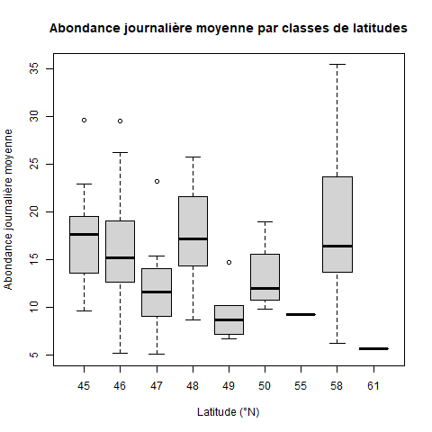
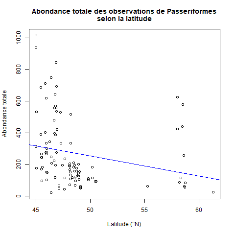

Introduction {.unnumbered}
========================================
La migration des oiseaux a toujours été un sujet d’intérêt écologique et il n’y en manque pas au Québec. Donc, assisté de donnée de présence d’espèces, nous avons ciblé les passeriformes comme sujet d’étude, car c’est le plus grand ordre d’oiseau. Dans un premier temps nous allons analyser le nombre d’espèces présentes selon la latitude, ensuite nous aborderons l’abondance de passeriformes selon la latitude pour en finir avec une analyse de l’abondance mensuelle moyenne des passeriformes. Le but est d’estimer si la tendance de présence des passeriformes est comparable aux autres ordres, ainsi qu’estimer un taux de migration des passeriformes.

Méthodes et résultats {.unnumbered}
========================================
Une courte description de la méthode et des résultats

Discussion {#submitting-manuscripts .unnumbered}
========================================

{width=50% height=40%}

Les distributions par latitude semblent beaucoup varier, cela peut être par cause de différence d’effort d’échantillonnage par latitude ou même par site. Une autre considération est que les espèces migratrices ont peut-être des observations à 58, ainsi que des observations répétées plus tard dans l’année entre 45 et 50. La distribution elle-même comporte des valeurs semblables de 45 à 48 de latitude et un gros pic à 58. On prédit qu’environ 75% des espèces situées à une latitude de 55 ou plus migreront vers le sud, comparer à 55-65% des espèces qui sont à des latitudes de 45-50 @newton_bird_1996. C’est pourquoi nous pouvons être confiant qu’il y a probablement de la lecture double entre les espèces à 58 et ceux qui sont retrouvés plus basses. L’autre graphique montre que la tendance de distribution est assez nulle selon l’autre graphique de distribution qui n’a pas été simplifié par unité de latitude ce qui signifie que la distribution des oiseaux est assez uniforme et la latitude importe peu à leur présence. En fait, les niches selon les latitudes sont remplies et il n’y a pas de pression évolutive qui provient de ce facteur dans le jour présent @rabosky_minimal_2015, donc on s’attend justement à une distribution uniforme. Le graphique atteint nos attentes initiales, mais avec une latitude 58 qui a un étendu plus grand que prévu, probablement dû à l’effet de la migration. 

{width=50% height=40%}

Les résultats nous démontrent une grande abondance d’observation entre les latitudes 45 et 50, ainsi qu’une présence modérée d’observation à proximité de la latitude 60. La tendance générale de notre modèle semble démontrer une baisse des observations plus les sites sont aux nord. Ces résultats ne sont pas surprenants lorsqu'on considère que la majorité des passereaux sont des oiseaux migrateurs qui pour la plupart préfère un climat plus tempéré qui est typiquement plus présent dans le sud du Québec @desgranges_potential_2010. La distribution des oiseaux serait influencée autant par des facteurs climatiques que des facteurs en liens avec les habitats suggérant que le climat peut indirectement influencer la distribution des oiseaux en affectant la végétation @desgranges_potential_2010. Malgré cette tendance, nous avons un bon nombre d’observation à proximité de la latitude 60 ce qui semble aller à l’encontre de notre tendance. Il faut se rappeler que nos sites d’échantillonnages sont répartis à différentes latitudes et que la majorité de nos sites se situe dans le sud du Québec sauf pour quelques sites répartis dans le nord du Québec à proximité de la latitude 60. L’absence de site entre ces deux extrêmes viendrait expliquer pourquoi il y a une chute si soudaine entre les abondances d’observations. L’observation d’espèces de passereaux nordiques reste tout de même conforme avec les résultats obtenus par @desgranges_potential_2010 qui eux avaient pu observer que certaines espèces restaient vraiment dans le nord de leur aire de répartition. Il serait intéressant de refaire l’expérience avec plus de sites qui seraient mieux répartis pour essayer de former un gradient continu de site d’observation du sud au nord. Ce gradient permettrait d’observer encore mieux la tendance ou à l’inverse de démontré que cette tendance était seulement l’objet de l’écart entre la répartition de nos sites d’observations. 

{width=50% height=40%}

La tendance d’abondance d’observations suit bien ce à quoi on s’attendrait dans un contexte de suivit d’oiseaux migrateurs selon les mois de l’année. On peut observer une hausse au niveau des observations en mars ce qui coïncide avec l’arrivée des espèces migratrices au Québec @canada_periodes_2018. Cette hausse est aussi dû au début de la période de nidification qui va se dérouler jusqu’en mai [@canada_periodes_2018;@noauthor_saison_nodate]. Le deuxième pic d’observation est au mois d’août qui est le début de la migration inverse des espèces qui vont graduellement commencer leur migration au sud jusqu’au mois de novembre où les dernières espèces migratrices quittent le Québec pour aller vers des climats plus chauds [@canada_periodes_2018;@noauthor_saison_nodate]. Notre modèle représente donc bien les variations attendues d’observations des oiseaux migrateurs selon les différents mois de l’année au Québec. 

----------

\showmatmethods
Références {#references .unnumbered}
=====================================
\pnasbreak
