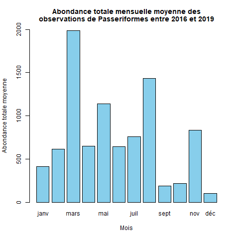

Introduction {.unnumbered}
========================================
La migration des oiseaux a toujours été un sujet d’intérêt écologique au Québec. Dans les dernières années, de plus en plus de recherches utilisant des points d’écoute ont été réalisées et c'est ce type de donnée que nous avons tenté d’utiliser afin de créer une banque de données qui pourrait être utilisé à des fins de recherche. Nous avons ciblé les passériformes comme sujet d’étude, car c’est le plus grand ordre d’oiseau présent dans la banque de données. Dans un premier temps, nous avons analysé le nombre d’espèces présentes selon la latitude, puis l’abondance des passériformes selon la latitude et pour finir nous avons effectué une analyse de l’abondance mensuelle moyenne des passériformes.

Méthodes et résultats {.unnumbered}
========================================
Les données utilisées proviennent du suivi de la biodiversité acoustique du ministère de l'Environnement, de la Lutte contre les Changements Climatiques, de la Faune et des Parcs (MELCCFP). Ces données sont obtenues par enregistrement des sons entendus à certains points où les enregistreurs sont posés, puis analysés par des taxonomistes pour identifier quelles espèces sont entendues. Le protocole est disponible ici : [Protocole d’inventaire acoustique multiespèce avec appareil Song Meter Mini Bat (SMMB)] (https://mffp.gouv.qc.ca/documents/faune/protocole-inventaire-acoustique-multiespece.pdf). Les résultats obtenus sont quatre figures observant les abondances par latitude des toutes les observations, l’abondance par latitude des passériformes et l’abondance par mois des passériformes.

Discussion {#submitting-manuscripts .unnumbered}
========================================

{width=50% height=40%}

Les distributions par latitude de la figure \ref{fig:plot1} semblent beaucoup varier, cela peut être par cause de différence d’effort d’échantillonnage par latitude ou même par site. Une autre considération est que les espèces migratrices ont peut-être des observations à 58, ainsi que des observations répétées plus tard dans l’année entre 45 et 50. La distribution elle-même comporte des valeurs semblables de 45 à 48 de latitude et un gros pic à 58. On prédit qu’environ 75% des espèces situées à une latitude de 55 ou plus migreront vers le sud, comparé à 55-65% des espèces qui sont à des latitudes de 45-50 @newton1996bird. C’est pourquoi nous pouvons être sûrs qu’il y a probablement de la lecture double entre les espèces à 58 et ceux qui sont retrouvés plus bas. L’autre graphique montre que la tendance de distribution est assez nulle selon l’autre graphique de distribution qui n’a pas été simplifié par unité de latitude ce qui signifie que la distribution des oiseaux est assez uniforme et la latitude importe peu à leur présence. En fait, les niches selon les latitudes sont remplies et il n’y a pas de pression évolutive qui provient de ce facteur dans le jour présent @rabosky2015minimal, donc on s’attend justement à une distribution uniforme. Le graphique atteint nos attentes initiales, mais avec une latitude 58 qui a une étendue plus grande que prévu, probablement due à l’effet de la migration.  

{width=50% height=40%}

Les résultats de la figure \ref{fig:plot2} nous démontrent une grande abondance d’observation entre les latitudes 45 et 50, ainsi qu’une présence modérée d’observation à proximité de la latitude 60. La tendance générale de notre modèle semble démontrer une baisse des observations plus les sites sont aux nord. Ces résultats ne sont pas surprenants lorsqu'on considère que la majorité des passereaux sont des oiseaux migrateurs qui pour la plupart préfèrent un climat plus tempéré qui est typiquement plus présent dans le sud du Québec @desgranges2010potential. La distribution des oiseaux serait influencée autant par des facteurs climatiques que des facteurs en lien avec les habitats suggérant que le climat peut indirectement influencer la distribution des oiseaux en affectant la végétation @desgranges2010potential. Malgré cette tendance, nous avons un bon nombre d’observations à proximité de la latitude 60, ce qui semble aller à l’encontre de notre tendance. Il faut se rappeler que nos sites d’échantillonnages sont répartis à différentes latitudes et que la majorité de nos sites se situe dans le sud du Québec sauf pour quelques sites répartis dans le nord du Québec à proximité de la latitude 60. L’absence de site entre ces deux extrêmes viendrait expliquer pourquoi il y a une chute si soudaine entre les abondances d’observations. L’observation d’espèces de passereaux nordiques reste tout de même conforme avec les résultats obtenus par @desgranges2010potential qui eux avaient pu observer que certaines espèces restaient vraiment dans le nord de leur aire de répartition. Il serait intéressant de refaire l’expérience avec plus de sites qui seraient mieux répartis pour essayer de former un gradient continu de site d’observation du sud au nord. Ce gradient permettrait d’observer encore mieux la tendance, ou à l’inverse, de démontré que cette tendance était seulement l’objet de l’écart entre la répartition de nos sites d’observations.

{width=50% height=40%}

La tendance d’abondance d’observations qu'on observe dans la figure \ref{fig:plot3} suit bien ce à quoi on s’attendrait dans un contexte de suivi d’oiseaux migrateurs selon les mois de l’année. On peut observer une hausse au niveau des observations en mars, ce qui coïncide avec l’arrivée des espèces migratrices au Québec [@gouvernement_canada;@saison_orinthologues]. Cette hausse est aussi due au début de la période de nidification qui va se dérouler jusqu’en mai [@gouvernement_canada;@saison_orinthologues]. Le deuxième pic d’observation est au mois d’août qui est le début de la migration inverse des espèces qui vont graduellement commencer leur migration au sud jusqu’au mois de novembre où les dernières espèces migratrices quittent le Québec pour aller vers des climats plus chauds [@gouvernement_canada;@saison_orinthologues]. Notre modèle représente donc bien les variations attendues d’observations des oiseaux migrateurs selon les différents mois de l’année au Québec. 

Conclusion {.unnumbered}
========================================
En conclusion, nos résultats de recherche sont pour la plupart ce à quoi nous nous attendions. Un changement que nous pourrions apporter à cette recherche serait d’utiliser plus de points d’écoute répartis uniformément sur le territoire du Québec. Cette meilleure répartition pourrait nous permettre d’obtenir de meilleures données et un meilleur patron de détection et dispersion. Un projet de cette envergure répété sur plusieurs années pourrait permettre de détecter l’impact qu’a les changements climatiques sur la répartition et la dispersion des passériformes au Québec, ainsi que de vérifier s’il y a des modifications au niveau des évènements migratoires. Ce projet pourrait permettre un meilleur suivi des populations d’oiseaux au Québec et permettre de meilleures actions de conversation.

----------

\showmatmethods
Références {#references .unnumbered}
=====================================
\pnasbreak
